# Listy - Smart To-Do & Shopping List

Listy is a modern, AI-powered Flutter application for managing tasks and shopping lists. It features voice input, vision-based product recognition, and smart product predictions.

## Features

- **Dual Mode:** Switch seamlessly between "To-Do" and "Shopping" modes.
- **🤖 Powerful AI Integration (Powered by Gemini):**
  - **Voice Command:** Simply speak to add tasks or ask questions. The app understands context and intent.
  - **Visual Intelligence:** Snap a photo of a product or a handwritten list, and the AI will automatically extract items and add them to your shopping list.
  - **Smart Predictions:** As you type, the app suggests relevant products or tasks, making entry lightning fast.
- **Localization:** Supports English, German, Japanese, and Chinese.
- **Smart Filtering:** Filter by Priority (Urgent, Medium, Low) or List Status (Open, In Cart, Done).
- **Dark Mode:** Fully adaptive UI for light and dark themes.
- **Privacy:** Data is stored locally on the device using JSON.

## Project Structure

- `lib/main.dart`: Entry point and app initialization.
- `lib/screens/`: Main UI screens (HomeScreen).
- `lib/widgets/`: Reusable UI components (TaskTile, FilterSegments, ChatDialog, etc.).
- `lib/providers/`: State management (DataProvider, ThemeProvider).
- `lib/services/`: Logic layer (AIService, StorageService, LocalizationService).
- `lib/models/`: Data models (Task).

## Requirements

- Flutter SDK: >=3.0.0
- Dart SDK: >=3.0.0
- iOS / Android Simulator or Device

## Installation

1.  Clone the repository.
2.  Run `flutter pub get` to install dependencies.
3.  Run `flutter run` to start the app.

## 🔑 Configuration (BYOK - Bring Your Own Key)

Listy follows a **BYOK** model. You need to provide your own API keys in the app settings to unlock AI features.

- **Text Intelligence (Default):** Uses **DeepSeek** via **OpenRouter** for smart text understanding and list creation.
- **Multimodal features (Voice & Image):** To use Visual Intelligence (Camera) and advanced Voice features, you need a valid API Key for **Google Gemini** or **OpenAI ChatGPT**.

👉 *Go to Settings > AI Configuration to enter your keys.*

## 📸 Gallery

  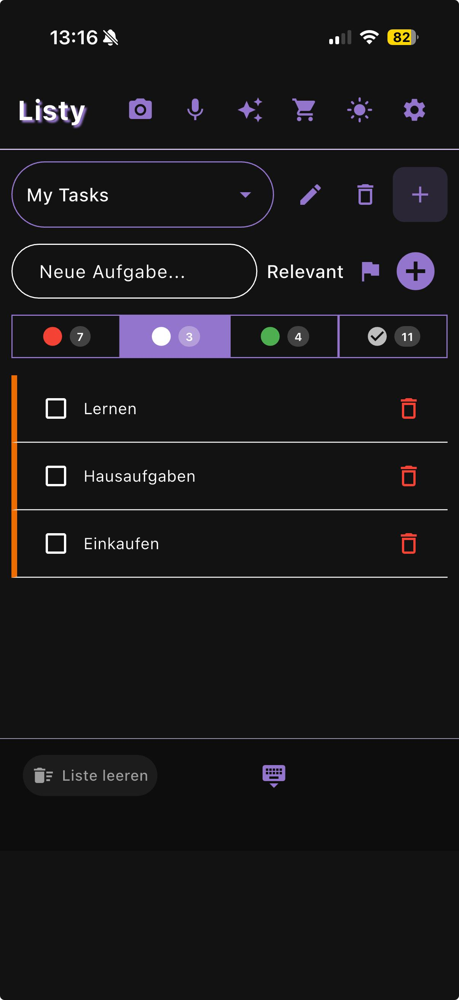
  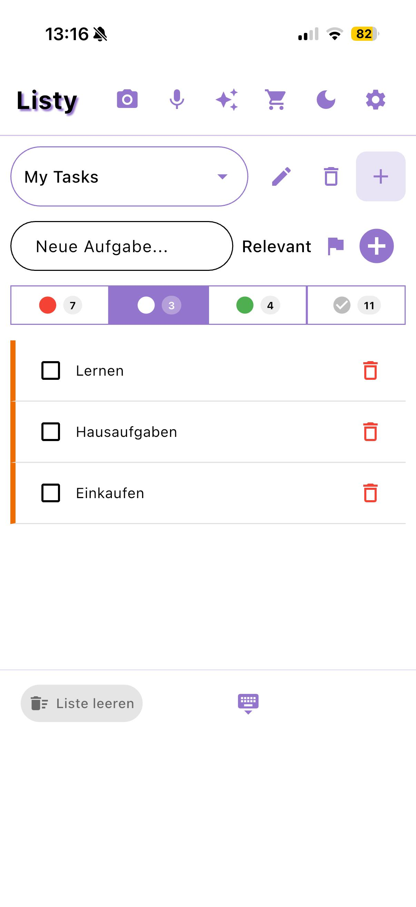 
  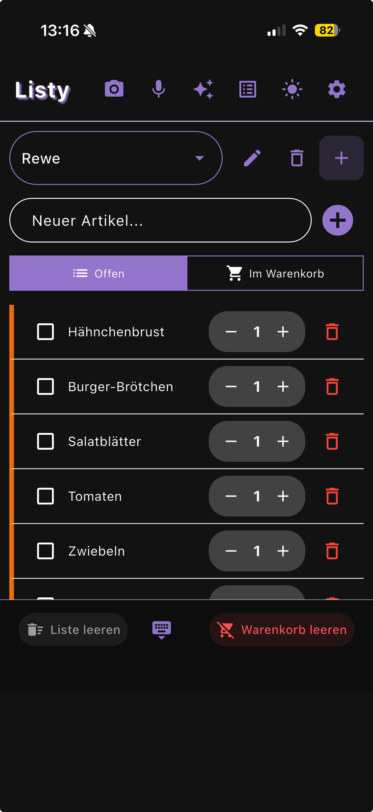

  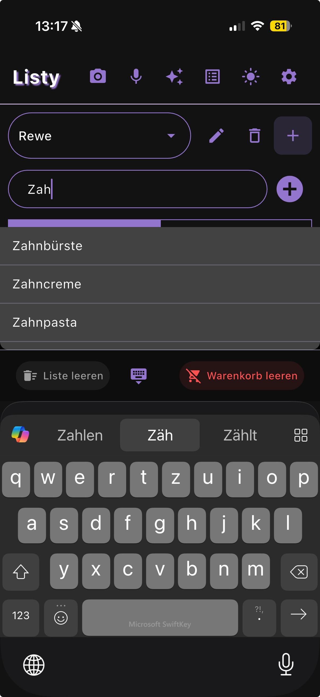
  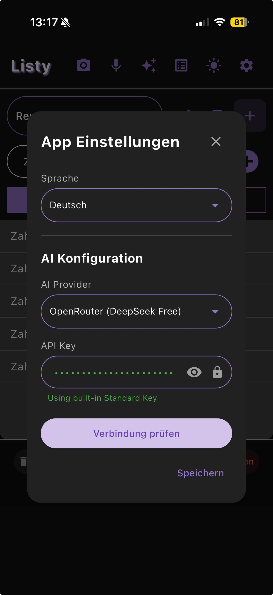
  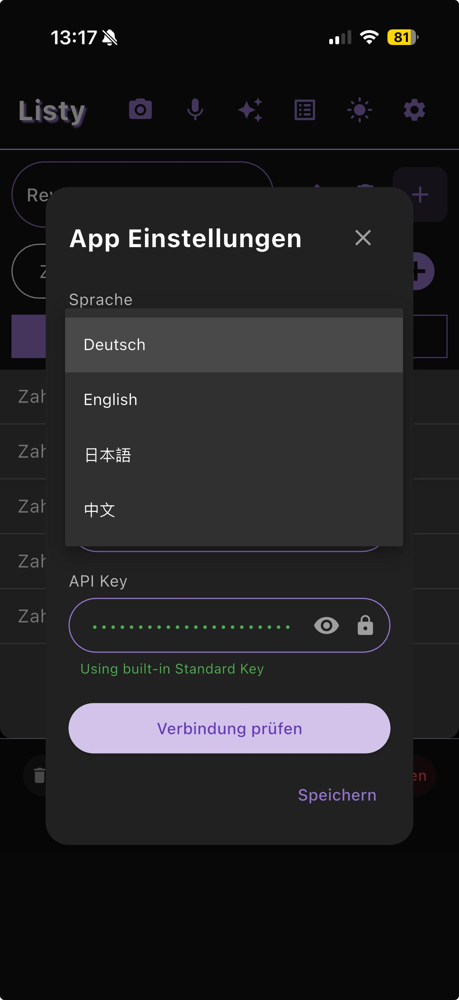

  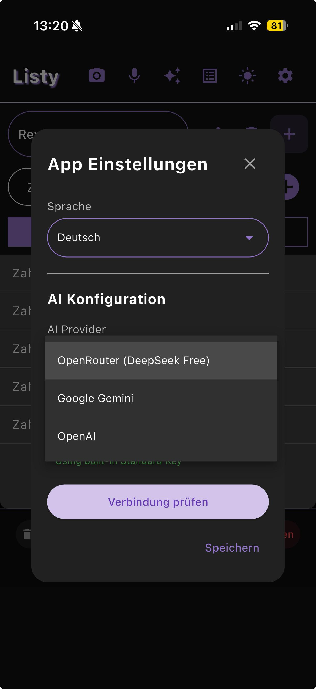
  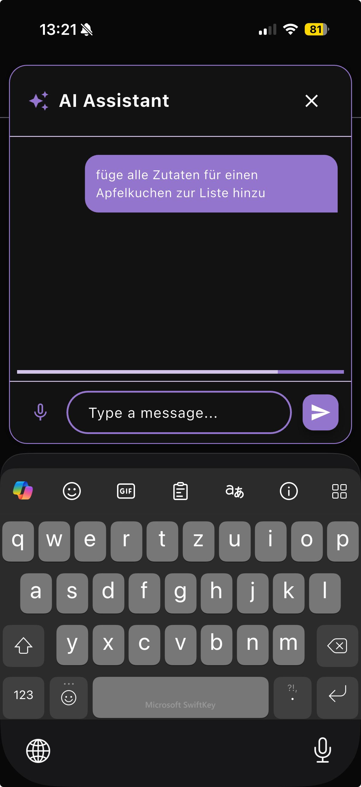
  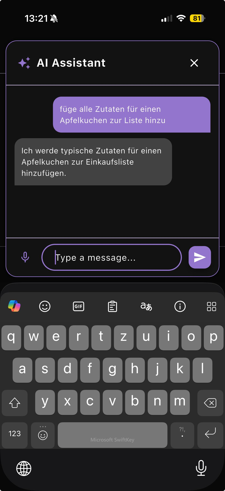

  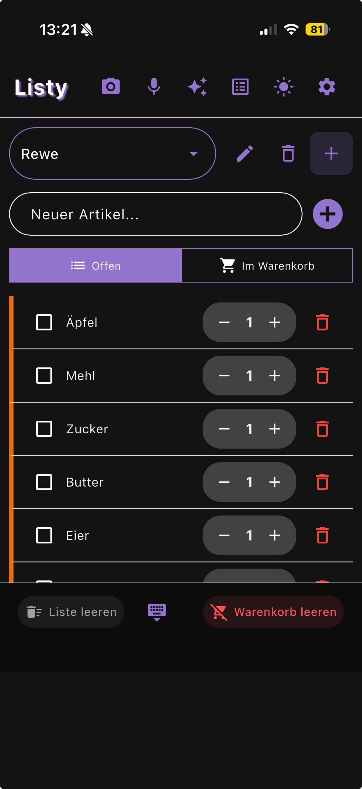
  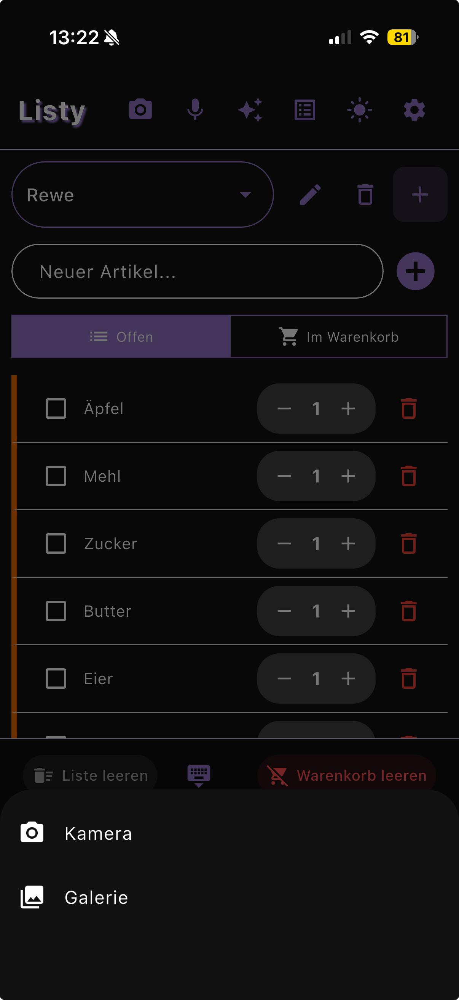

## License

Licensed under the GNU Affero General Public License v3.0 (AGPLv3). See the LICENSE file in the repository for details.
